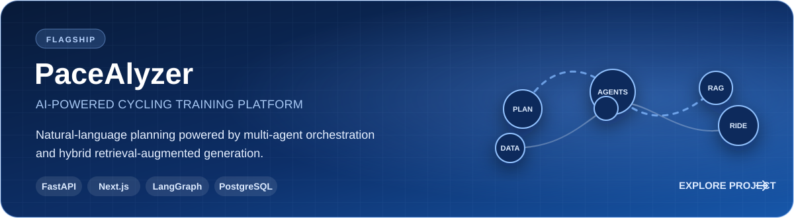
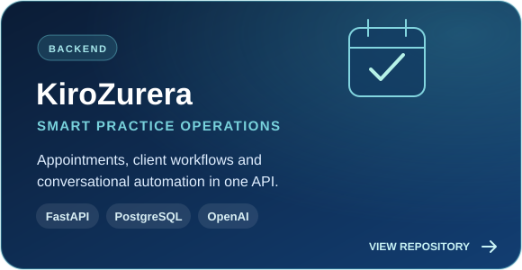
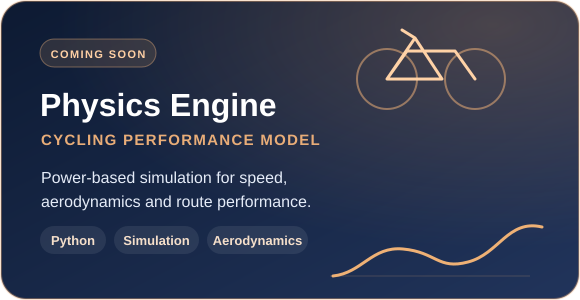

<div align="center">
  

  <br />
  <br />

  <a href="mailto:max.velasco.rajo@gmail.com">
    
  </a>
  <a href="https://github.com/MaxVelascoo">
    
  </a>
  
</div>

## About me

I'm a **Software Engineer** from Barcelona and a Computer Engineering graduate from **Universitat Politècnica de Catalunya (UPC)**.

I currently work at **NTT DATA**, building AI-based solutions, multi-agent systems and RAG pipelines. I enjoy turning complex ideas into reliable software, with a special interest in backend architecture, applied AI and distributed systems.

```text
Current focus  ->  AI agents, RAG and production-ready backend systems
Also into      ->  Cloud architecture, performance and algorithms
Outside code   ->  Cycling and sports technology
```

## Tech stack

<div align="center">
  <p>
    
  </p>
  <p>
    
  </p>
</div>

<div align="center">
  
  
  
  
  
</div>

## Featured work

<p align="center">
  <a href="https://github.com/MaxVelascoo/PaceAlyzer_Public">
    
  </a>
</p>

<p align="center">
  <a href="https://github.com/MaxVelascoo/kirozurera_backend"></a>
  
</p>

## GitHub activity

<div align="center">
  <picture>
    <source
      srcset="https://github-profile-summary-cards.vercel.app/api/cards/stats?username=MaxVelascoo&theme=github_dark"
      media="(prefers-color-scheme: dark)"
    />
    <source
      srcset="https://github-profile-summary-cards.vercel.app/api/cards/stats?username=MaxVelascoo&theme=github"
      media="(prefers-color-scheme: light), (prefers-color-scheme: no-preference)"
    />
    
  </picture>
  <picture>
    <source
      srcset="https://github-profile-summary-cards.vercel.app/api/cards/repos-per-language?username=MaxVelascoo&theme=github_dark"
      media="(prefers-color-scheme: dark)"
    />
    <source
      srcset="https://github-profile-summary-cards.vercel.app/api/cards/repos-per-language?username=MaxVelascoo&theme=github"
      media="(prefers-color-scheme: light), (prefers-color-scheme: no-preference)"
    />
    
  </picture>
</div>

---

<div align="center">
  <sub>Always learning, building and looking for the next interesting problem.</sub>
</div>
